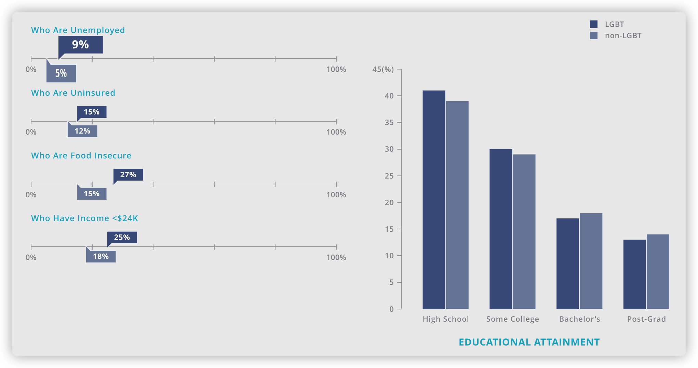
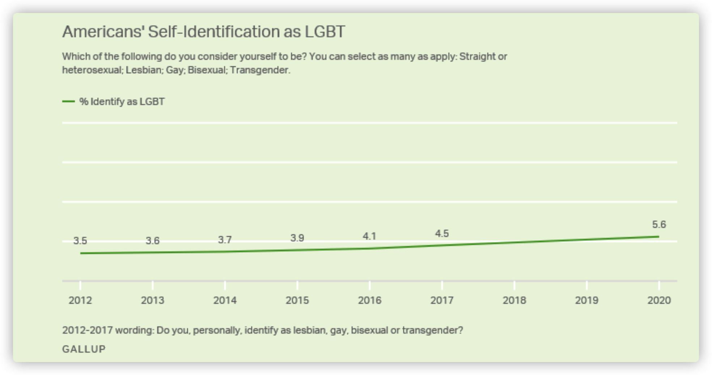
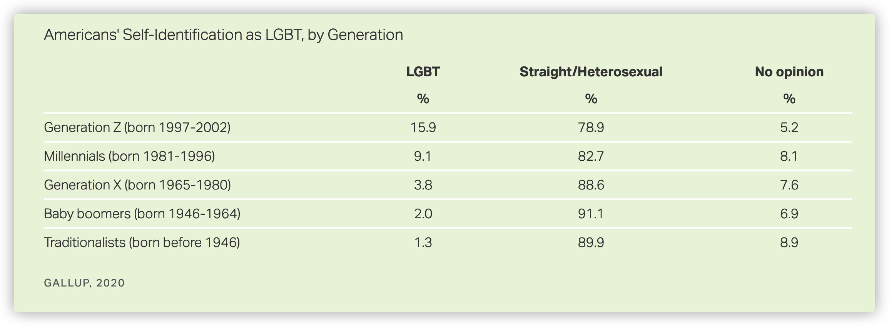

```{r setup, include=FALSE}
knitr::opts_chunk$set(echo = TRUE)

library(tidyverse)
library(dplyr)
library(here)
library(ggplot2)
library(ggpubr)
library(haven)
library(tidyr)
library(sqldf)
```

# Introduction

The Great Recession has been a worldwide crisis that reconstructed the economy and was deep, synchronous and global. Canadian GDP dropped by 3.3 percent, US GDP by close to 4 percent, that of the Euro area by 5 percent, and that of Japan by more than 8 percent. The impact on international trade has been severe that all G20 countries experienced serious reductions in trade[@recession]. Apart from the economic impact, the great recession also had a negative impact on the country's birth rate.

In the United States, unemployment rates, mortgage foreclosures, and poverty rates rose while housing values fell, but the extent of these changes varied widely across local areas. Another impact from the depressed economic condition is delayed childbearing, and others to hasten it. The fertility rate declined at the national level, dropping from a recent high in 2007 of 69.5 births per 1,000 women aged 15 to 44, to 63.2 for 2012. There was, however, great variation by state, age, and ethnicity, with younger and Hispanic women showing disproportionate decreases[@fertility]. The significant consequence on fertility rate would make us wonder how severe is America being affected by the great recession. However,  by comparing currency devaluations, equity market declines, and rising sovereign bond spreads, the U.S. is the third less affected country[@rank].

Prior research suggests that stress may be linked to riskier sexual activity. Financial hardship and poverty can negatively affect cognitive function, and shorten the time horizons over which individuals make cost-benefit determinations. Alternatively, fertility may be unaffected by economic conditions if cultural norms related to the context and timing of births are particularly influential. For example, non-marital births are more socially consequential for some racial and ethnic groups, and in some geographic areas. For some individuals, these social norms may outweigh any economic considerations[@fertility]. The same consideration of religious belief could also be applied to other countries.

As mentioned by @cite_original, the basic approach to many economic problems is maximizing utility. This approach recognized that children bring people utility but also comes with associated costs including time and money. This approach to modeling the decision to have a child leads to standard predictions of price and income effects. Direct consideration of costs could be like housing and medical care. Other times the price effect is indirect, as the opportunity cost of a woman’s time. Holding prices and quality constant, an increase in income will lead people to choose to have more children. This positive relationship between income and births may come as a surprise to some readers, given the negative relationship between birth rates and income or per-capita GDP observed over time and place[@cite_original]. However, this is enough for us to consider whether the birth rates are worldwide affected in the same negative direction after the Great Recession.

Another factor other than policy or economic factors that might have affected the fertility rate is cohort effect, more specifically, in this paper we focus on the rise of the LGBT community. The LGBT activity started in the 1920s and had a huge progress after the 2000s[@same_sex_marriage_states_2022]. A lot of laws that prohibited homosexual relationships were lifted and homosexual couples can get married legally and adopt kids, there is also propaganda that encourages homosexuality. Birth rates and LGBT was found to be highly correlated, the growth of LGBT population could lead to lower birth rate and the growth of LGBT population is increasing rapidly in the younger generations.

In this paper, we will investigate the effect of the Great Recession on the birth rate in different countries, and we will also explore the effect of the LGBT movement on the birth rate.

# Data

We started our analysis by using R [@r], dplyr[@dplyr], tidyverse[@tidyverse]. Graphs are generated using ggpubr[@ggpubr] and ggplot2[@ggplot2].

## Data Source
Part of our data are from the NCHS(National Center for Health Statistics)[@nvss], in particular, we acquired the US birth rate data for the past 40 years, Figure \@ref(fig:fig-past-40-years) shows the US birth rate from 1980 - 2020, as we can see, the birth rate declined significantly after 2007, which is the time of the Great Recession. We also generated data from U.S. Birth Rate 1950-2022[@birthrate]. We selected the top 3 countries that are affected most and least by the Great Recession according to rankings determined by comparing currency devaluations, equity market declines, and rising sovereign bond spreads. These measures tend to track developments in the real economy during times of economic crisis when financial strain handicaps consumption, investment, and in many cases government spending, which limits GDP and employment growth[@rank].

The data used to analyze the impact to birth rate brought by LGBT population growth comes from the School of Law, UCLA[@will_institute]. The analysis was based on the data collected for the Gallup Daily Tracking survey. Respondents were obtained through list-assisted random digit dial (70% cell phone, 30% landline).

The data used to analyze LGBT population trends comes from GALLUP News [@us_lgbt_trend], which is the source of data of the LGBT Demographics analysis[@will_institute]. The data is based on telephone interviews conducted in 2020 with a random sample of 15,349 adults (18+), living in the 50 states and the District of Columbia. The entire sample of national adults has a margin of sampling error is $\pm1\%$ at the $95\%$ confidence level. The results based on the total sample of 692 LGBT adults has a sample error of $\pm5\%$ with a $95\%$ confidence level.

## Data Characteristics
The NCHS data source is very detailed, it contains a lot of demographic and geographic information. For example, for each birth, the data set records the race of the father and the mother, this can help us to analyze the birth rate among different race groups. It also contains the age of the mother and father, this can be really helpful if we want to examine the trend of teenager pregnancy.


The LGBT demographics data spans 2012 to 2017. The sample is approximately 350,000 U.S. adults (18+) who resides in the 50 states and district of Columbia. The data describes LGBT Data & Demographics such as LGBT proportion of population by states, characteristics of LGBT people (race, gender distribution, etc.), socioeconomic indicators (income, education level, etc.) and state comparison.

The GALLUP News data used to analyze LGBT population trend shows the LGBT population proportion and distribution trend from 2012 to 2020 by year and generation, as well as the distribution of sexual orientation of different gender identities.

Figure \@ref(fig:fig-density-state) shows the geographical distribution of LGBT and same sex couple population density, as well as birth rate density[@cite_original][@will_institute]. The three plots can give us a general idea that birth rate is correlated to LGBT population density. More detailed analysis will be in the [Results] and [Discussion] section.


```{r echo = FALSE, fig-density-state, fig.cap='Density by State', fig.subcap=c('Same Sex Couple State Density', 'LGBT State Density', 'Birth Rate Distribution by State'), out.width='.49\\linewidth', fig.asp=1, fig.ncol = 2}
knitr::include_graphics(c("./images/same-sex-couple-state-density.png", "./images/LGBT-state-density.png", "./images/state-birth-rate-distribution.png"))
```

```{r, fig-past-40-years, fig.cap="US Birth Rate in the past 40 years", echo=FALSE, warning=FALSE, message = FALSE, fig.width=10, fig.height=4}
# import the csv
US_birth_date_from_1985_to_2020 <- read_csv(here::here("inputs/data/Birthrate.csv"))

# Plot the graph
ggplot(data=US_birth_date_from_1985_to_2020, aes(x=`year`, y=`brate_all`, group=1)) +
  geom_line()+
  geom_point() +
  ylim(50, 80) +
  xlab("Year") + ylab("Births per 1,000 women age 15-44")
```

```{r, include=FALSE}
#importing the Birth Rate 1950-2022 of the least affected countries: China, Japan, and the United States from https://www.macrotrends.net/countries/USA/united-states/birth-rate
#Then modify the 'date' variable of each into Date format for graphs by using as.Date
china_data <- read_csv(here::here("inputs/data/china-population-2022-02-25.csv"))
china_data$date <- as.Date(china_data$date)
str(china_data)

japan_data <- read.csv(here::here("inputs/data/japan-population-2022-02-25.csv"))
japan_data$date <- as.Date(japan_data$date)
str(japan_data)

us_data <- read_csv(here::here("inputs/data/united-states-population-2022-02-26.csv"))
us_data$date <- as.Date(us_data$date)
str(us_data)

sa_data <- read_csv(here::here("inputs/data/south-africa-population-2022-02-26.csv"))
sa_data$date <- as.Date(sa_data$date)
str(sa_data)

```

```{r, include=FALSE}
#importing the Birth Rate 1950-2022 of the most affected countries: Ukraine, Argentina, Hungary, and Poland from https://www.macrotrends.net/countries/USA/united-states/birth-rate
#Then modify the 'date' variable of each into Date format for graphs by using as.Date

ukraine_data <- read_csv(here::here("inputs/data/ukraine-population-2022-02-26.csv"))
ukraine_data$date <- as.Date(ukraine_data$date)
str(ukraine_data)

argentina_data <- read_csv(here::here("inputs/data/argentina-population-2022-02-26.csv"))
argentina_data$date <- as.Date(argentina_data$date)

hungary_data <- read_csv(here::here("inputs/data/hungary-population-2022-02-27.csv"))
hungary_data$date <- as.Date(hungary_data$date)

poland_data <- read_csv(here::here("inputs/data/poland-population-2022-02-26.csv"))

poland_data$date <- as.Date(poland_data$date)
```

# Results

## Global Comparison of Fertility Rate Under The Great Recession
It shows that although the United States is at the epicenter of the global economic crisis, it is one of the countries least affected by the financial fallout. Large industrialized nations like the United States, Japan, and Germany have benefited from increasing global demand for relatively stable economies in which to invest. Instead, it is several developing countries, notably those with vulnerable capital accounts and weak macroeconomic fundamentals, that are experiencing severe economic downturns disproportionate to their roles in the crisis[@rank].

\newpage
```{r least-affected, echo=FALSE, fig.cap="Births per 1000 People of Top Least Affected Countries"}
#Generating time series graphs of births per 1000 people for each least affected country

china <- ggplot(china_data,aes(x=date,y= `Births per 1000 People`)) + 

   labs(title = "China",
        x = "Year",
        y = "Births per 1000 People ") +
  theme_minimal() +
  geom_line()

japan <- ggplot(japan_data,aes(x=date,y= Births.per.1000.People)) + 

   labs(title = "Japan",
        x = "Year",
        y = "Births per 1000 People ") +
  theme_minimal() +
  geom_line()


us <- ggplot(us_data,aes(x=date,y= `Births per 1000 People`)) + 

   labs(title = "The United States",
        x = "Year",
        y = "Births per 1000 People ") +
  theme_minimal() +
  geom_line()


sa <- ggplot(sa_data,aes(x=date,y= `Births per 1000 People`)) + 
   labs(title = "South Africa",
        x = "Year",
        y = "Births per 1000 People ") +
  theme_minimal() +
  geom_line()

#Arranging them on the same page
ggarrange(china, japan, us, sa + rremove("x.text"),
          ncol = 2, nrow = 2)
```


Figure \@ref(fig:least-affected) shows the changes of births per 1000 people of China, Japan, the U.S, and South Africa since 1950 with the prediction for the future. The birth rates of China and South Africa were obviously higher than that of the U.S. and Japan. However, around the year of recession, the birth rate of China and Japan dropped even harder than the U.S. on the absolute level that is lower than 10 births per 1000 people.


```{r, most-affected, echo=FALSE, fig.cap="Births per 1000 People of Top Most Affected Countries"}
#Generating time series graphs of births per 1000 people for each most affected country

ukraine <- ggplot(ukraine_data,aes(x=date,y= `Births per 1000 People`)) + 
   labs(title = "Ukraine",
        x = "Year",
        y = "Births per 1000 People ") +
  theme_minimal() +
  geom_line()


argentina <- ggplot(argentina_data,aes(x=date,y= `Births per 1000 People`)) + 
   labs(title = "Argentina",
        x = "Year",
        y = "Births per 1000 People ") +
  theme_minimal() +
  geom_line()


hungary <- ggplot(hungary_data,aes(x=date,y= `Births per 1000 People`)) + 
   labs(title = "Hungary",
        x = "Year",
        y = "Births per 1000 People ") +
  theme_minimal() +
  geom_line()

poland <- ggplot(poland_data,aes(x=date,y= `Births per 1000 People`)) + 
   labs(title = "Poland",
        x = "Year",
        y = "Births per 1000 People ") +
  theme_minimal() +
  geom_line()


ggarrange(ukraine, argentina, hungary, poland + rremove("x.text"),
          ncol = 2, nrow = 2)
```


Figure \@ref(fig:most-affected) shows the changes of births per 1000 people of Ukraine, Argentina, Hungary, Poland since 1950 with prediction for the future. All these most affected countries have lower initial birth rates than that of the those least affected countries. However, the levels of births per 1000 people were similar to those least affected countries around recession except Argentina. Ukraine, Hungary, and Poland also showed a potential increase after recession but continued to decline afterwards.


## Cohort Effect

```{r cohort-plot, echo=FALSE, results='hide', message=FALSE, warning=FALSE, fig.cap="Children Ever Born by Mother Age and Birth Cohort", fig.height=4, fig.width=8}
# Read the dta
age_comp_pop <- read_dta(here::here("inputs/data/agecomp-seer.dta"))
# Filter out unwanted columns
age_comp_pop <- subset(age_comp_pop, select = -c(fem1519, fem2034, fem3544, stname))
# group by and find the sum of all columns
age_comp_pop_grouped <- group_by(age_comp_pop, year) %>% summarise(across(everything(), sum))
# generate vector of column names that start with fem
age_comp_pop_grouped_start_with_fem <-
  select(age_comp_pop_grouped, starts_with("fem"))
fem_col_name <- colnames(age_comp_pop_grouped_start_with_fem)
# transform wide to long
age_comp_pop_long <- gather(age_comp_pop_grouped, mage, fem, fem_col_name)
# generate new columns
age_comp_pop_long$mage <- gsub("^.{0,3}", "", age_comp_pop_long$mage)
# transform it into a numeric value
age_comp_pop_long$mage <- as.numeric(as.character(age_comp_pop_long$mage))
age_comp_pop_long$cohort <- with(age_comp_pop_long, year - mage)
age_comp_pop_long$cohort2 <- ''
# assign different numbers based on years
age_comp_pop_long$cohort2[age_comp_pop_long$cohort >= 1968 & age_comp_pop_long$cohort <= 1972] <- 1
age_comp_pop_long$cohort2[age_comp_pop_long$cohort >= 1973 & age_comp_pop_long$cohort <= 1977] <- 2
age_comp_pop_long$cohort2[age_comp_pop_long$cohort >= 1978 & age_comp_pop_long$cohort <= 1982] <- 3
age_comp_pop_long$cohort2[age_comp_pop_long$cohort >= 1983 & age_comp_pop_long$cohort <= 1987] <- 4
age_comp_pop_long$cohort2[age_comp_pop_long$cohort >= 1988 & age_comp_pop_long$cohort <= 1992] <- 5
age_comp_pop_long$cohort2[age_comp_pop_long$cohort >= 1993 & age_comp_pop_long$cohort <= 1997] <- 6
age_comp_pop_long <- subset(age_comp_pop_long, cohort2 != '')

names(age_comp_pop_long)[names(age_comp_pop_long) == 'fem'] <- 'pop'
age_comp_pop_long_group <- group_by(age_comp_pop_long, cohort2, mage) %>% summarise(pop_sum = sum(pop))
# read data files
cohort_analysis <- read_dta(here::here("inputs/data/nchs_cohort_analysis.dta"))
# merge two file together
merged_data <- merge(cohort_analysis, age_comp_pop_long_group, by = c("cohort2", "mage"))
# define new columns
merged_data$brate <- with(merged_data, numbirth/pop_sum*1000)
data_with_only_cohort_and_brate <- subset(merged_data, select = c(cohort2, brate, mage))
data_with_only_cohort_and_brate <- data_with_only_cohort_and_brate[order(data_with_only_cohort_and_brate$cohort2, data_with_only_cohort_and_brate$mage),]
# accmulate all the values
data_with_only_cohort_and_brate$brate <- ave(data_with_only_cohort_and_brate$brate, data_with_only_cohort_and_brate$cohort2, FUN=cumsum)
data_with_only_cohort_and_brate_grouped <- group_by(data_with_only_cohort_and_brate, cohort2, mage) %>% summarise(cum_brate = sum(brate) / 1000)
names(data_with_only_cohort_and_brate_grouped)[names(data_with_only_cohort_and_brate_grouped) == 'cohort2'] <- 'cohort'
final_data_wide_format <- spread(data_with_only_cohort_and_brate_grouped, key = cohort, value = cum_brate,  sep = '')
# drop all na value
data_with_cohort1 <- drop_na(final_data_wide_format, cohort1)
data_with_cohort2 <- drop_na(final_data_wide_format, cohort2)
data_with_cohort3 <- drop_na(final_data_wide_format, cohort3)
data_with_cohort4 <- drop_na(final_data_wide_format, cohort4)
data_with_cohort5 <- drop_na(final_data_wide_format, cohort5)
data_with_cohort6 <- drop_na(final_data_wide_format, cohort6)
# draw the plot
ggplot() +
  geom_line(data = data_with_cohort1, aes(x = mage, y = cohort1, color = "1968-1972"))+
  geom_line(data = data_with_cohort2, aes(x = mage, y = cohort2, color = "1973–1977")) +
  geom_line(data = data_with_cohort3, aes(x = mage, y = cohort3, color = "1977–1982")) +
  geom_line(data = data_with_cohort4, aes(x = mage, y = cohort4, color = "1983–1987")) +
  geom_line(data = data_with_cohort5, aes(x = mage, y = cohort5, color = "1988–1992")) +
  geom_line(data = data_with_cohort6, aes(x = mage, y = cohort6, color = "1993–1997")) +
  scale_color_manual(name = "Birth Cohorts", 
                     values = c("1968-1972" = "green", 
                                "1973–1977" = "blue", 
                                "1977–1982" = "orange", 
                                "1983–1987" = "gray",
                                "1988–1992" = "yellow4",
                                "1993–1997" = "lightblue"
                                )) + theme(legend.position = c(0.9, 0.5)) +
  xlab("Mother's Age") + ylab("Children ever born") + 
  ggtitle("Children Ever Born by Mother’s Age and Birth Cohort")
```

Research has shown that cohort effects may have contributed to the declines of birth rate in the US[@cite_original].
"Period effects reflect changes that affect everyone at a point in time, whereas cohort effects reflect changes across people born or raised in different years.
"[@cite_original].

We reproduced the plot showing Fertility Rate vs Mother's age from [@cite_original] in Figure \@ref(fig:cohort-plot). This plot is basically showing the fertility rate of women in different ages across 6 generations.
It's quite obvious that the 3 oldest cohorts (generations) have similar and higher fertility rates comparing to that of the 3 younger cohorts (generations).The 3 younger cohorts also have lower and lower fertility rate as their birthday moves forward (younger generation $\Rightarrow$ lower fertility rate).
This reflects the impact to birth rate brought by cohort effects.

```{r fig-parity, fig.cap="Parity (ages 15-44)", echo=FALSE, fig.height=4, fig.height=3}
# Import the dta
birth_pop <- read_dta(here::here("inputs/data/nchs_births_pop_1990_2019.dta"))
age_race_pop <- read_dta(here::here("inputs/data/age_race_comp_seer.dta"))
merged_data <- merge(birth_pop, age_race_pop, by = c("stname", "year"))

# Define new column
merged_data$pop2044 <- with(merged_data, `pop2024.y` + `pop2534.y` + `pop3544.y`)
# use a group by to get the sum
merged_data_grouped_by <- group_by(merged_data, year) %>% summarise(fb_sum = sum(numbirth_firstbirth), sb_sum = sum(numbirth_secondbirth), tb_sum = sum(numbirth_thirdbirth), fbp_sum = sum(numbirth_fourthbirth), pop_sum = sum(pop1544))
#define new columns based on existing columns
merged_data_grouped_by$brith_rate_fb <- with(merged_data_grouped_by, fb_sum / `pop_sum` * 1000)
merged_data_grouped_by$brith_rate_sb <- with(merged_data_grouped_by, sb_sum / `pop_sum` * 1000)
merged_data_grouped_by$brith_rate_tb <- with(merged_data_grouped_by, tb_sum / `pop_sum` * 1000)
merged_data_grouped_by$brith_rate_fbp <- with(merged_data_grouped_by, fbp_sum / `pop_sum` * 1000)
# merge the plot and add legends
ggplot(merged_data_grouped_by, aes(x=year)) + 
 geom_line(aes(y = brith_rate_fb, color = "First Birth")) + 
  geom_line(aes(y = brith_rate_sb, color="Second Birth")) +
  geom_line(aes(y = brith_rate_tb, color="Third Birth")) +
  geom_line(aes(y = brith_rate_fbp, color="Fourth Birth")) +
  scale_color_manual(name = "Parity (ages 15-44)", 
                     values = c("First Birth" = "steelblue", 
                                "Second Birth" = "orange", 
                                "Third Birth" = "gray", 
                                "Fourth Birth" = "yellow")) + 
  xlab("Year") + ylab("Birth Rate (births per 1000 women)") + ggtitle("Parity (ages 15-44)")
```

Figure \@ref(fig:fig-parity) is a reproduction of a plot showing trends in births by "parity" (referring to the number of children for a given woman) from [@cite_original]. The first and second births declined a lot since 2007, but the trend lines for the third and higher order births are comparatively flat.
The women giving their 3rd and 4th births are most likely older cohorts comparing to the cohorts giving their 1st and 2nd births. Again, this is another evidence showing the impact brought by cohort effects.


## Effect of LGBT Movement

### Laws for Same Sex Marriage

"On February 12, 2004, the first same-sex marriage in the United States happened in San Francisco, California."
"On May 17, 2004, Massachusetts became the first state and sixth jurisdiction in the world to legalize same-sex marriage."
"In 2008, California and Connecticut both legalized same-sex marriage, followed by Iowa, Vermont, and New Hampshire. Up until 2012, legalization came through state courts, the enactment of state legislation, or the result of the decisions of federal courts. On November 6, 2012, Maine, Maryland and Washington became the first states to legalize same-sex marriage through popular vote."
"On June 26, 2015, in the landmark civil rights case Obergefell v. Hodges, the Supreme Court ruled that the fundamental right to marry is guaranteed to same-sex couples by both the Due Process Clause and the Equal Protection Clause of the Fourteenth Amendment to the United States Constitution."[@same_sex_marriage_states_2022].

The first two dates mentioned above represents the beginning of the legalization of same-sex marriage in the US, and is quite close to 2007, when the significant drop of birth rate began. There may be a composition of effects causing the significant drop of birth rate in 2007, and the legalization of same-sex population could potentially be one of main causes.

### LGBT Demographics

LGBT is the acronym of the following 4 gender identities, **L** for Lesbian, **G** for gay, **B** for bisexual, **T** for transgender. By definition, these genders should have a much lower birth rate than that of the heterosexual as normal births of human must depend on a male and a female. 
Then changes in birth rate and changes in LGBT population should have a negative proportional relationship (i.e. Growth in LGBT population leads to lower birth rate).
Thus, the population changes in these population are very likely to make an impact on the birth rate of the US.

If we assume the simpliest scenario where we ignore race, gender distribution (equal percentage of male and female) and all other factors, and assume that no LGBT or same-sex-couple population give birth to a child, then there would be a perfect correlation (perfectly proportional) between LGBT population change and birth rate (i.e. an $x\%$ increase in LGBT population could lead to an $x\%$ decrease in birth rate). Let's define $\phi = \frac{\Delta Birth Rate}{\Delta LGBTPopulation}$ and call $\phi$ the BirthRate-LGBT coefficient for convenience. Basically, lower BirthRate-LGBT coefficient means lower birth rate while holding LGBT population constant. If we take other factors into account, the impact to birth rate could be even larger (i.e. $\phi<-1$).

```{r echo = FALSE, fig-gender-raising-children-distribution, fig.cap='Gender Distribution and Percentage Raising Children Distribution', fig.subcap=c('LGBT Gender Distribution', 'LGBT Percentage Raising Children', 'Same Sex Couple Gender Distribution'), out.width='.33\\linewidth', fig.asp=1, fig.ncol = 3}
knitr::include_graphics(c("./images/LGBT-Gender-distribution.png",
  "./images/LGBT-percentage-raising-children.png",
  "./images/same-sex-couple-gender-distribution.png"))
```

Figure \@ref(fig:fig-gender-raising-children-distribution) shows the gender distribution of LGBT and Same Sex Couple as well as well as the percentage raising children [@will_institute].
Figure \@ref(fig:fig-gender-raising-children-distribution) (a) and Figure \@ref(fig:fig-gender-raising-children-distribution) (c) clearly shows that more females are non-heterosexual than male are [@will_institute].
This could cause a lower BirthRate-LGBT coefficient on birth rate as only females are able to give births (in normal situations).

```{r echo = FALSE, fig-race-distribution, fig.cap='Race Distribution', fig.subcap=c('Same Sex Couple Race Distribution', 'LGBT Race Distribution'), out.width='.30\\linewidth', fig.asp=1, fig.ncol = 2, fig.align="center"}
knitr::include_graphics(c("./images/same-sex-couple-race-distribution.png", "./images/LGBT-race-distribution.png"))
```

From \@ref(fig:fig-race-distribution) we can see that White population takes up the majority of the population of LGBT (58%) and Same Sex Couple (74%) [@will_institute]. White is also the majority of the population in the US [@quickfacts], around 76.3% of the total population. Thus, larger LGBT population could lead to an even larger decrease in birth rate ($\phi<-1$, lower BirthRate-LGBT coefficient).

```{r echo = FALSE, fig-age-distribution, fig.cap='LGBT and Same Sex Couple Age Distribution', fig.subcap=c('Same Sex Couple Race Distribution', 'LGBT Race Distribution'), out.width='.40\\linewidth', fig.asp=1, fig.ncol = 2, fig.align="center"}
knitr::include_graphics(c("./images/same-sex-couple-age-distribution.png", "./images/LGBT-age-distribution.png"))
```

From \@ref(fig:fig-age-distribution) (a) we can see that most same sex couples fall in the age group 25-64 [@will_institute]. This period overlaps with the majority of the childbearing age. From \@ref(fig:fig-age-distribution) (b) [@will_institute], we can see that LGBT population decreases as age increases starting from the age or 18, which is the beginning of women's childbearing age. Around 90% of the LGBT population have their age between 18 and 64, which covers almost all of the child bearing ages. These 2 evidences also indicate that, growth of LGBT population could lead to a larger decrease in birth rate ($\phi < -1$, lower BirthRate-LGBT coefficient).

### Socioeconomic Inicators

```{r echo = FALSE, fig-LGBT-socioeconomic-indicators, fig.cap='Socioeconomic Indicators', fig.asp=1, fig.ncol = 1, out.width='.80\\linewidth', fig.align="center"}

```

Figure \@ref(fig:fig-LGBT-socioeconomic-indicators) shows some socioeconomic indicators classified by sexual orientation (LGBT or not), such as employment status, income level education level, and whether or not being insured and food insecure [@will_institute]. Darker color represents LGBT, lighter color represents non-LGBT.
From the plots, we can extract some socioeconomic indicators of LGBT. Comparing to non-LGBT population, LGBT population might be more likely to be unemployed, uninsured, being food insecure, having a low income (lower then $24k), and having a lower education level (percentage of LGBT population with Bachelor's or post-grad degree is slightly lower than that of the percentage of non-LGBT population).


### Geographical Distribution of LGBT Population and Birth Rate

Figure \@ref(fig:fig-density-state) (a) and Figure \@ref(fig:fig-density-state) (b) shows the population density of Same Sex Couple and LGBT by States in the US [@will_institute].
Figure \@ref(fig:fig-density-state) (c) [@cite_original] shows the birth rate distribution by state in the US. Darker color means higher density or larger negative change in birth rate [@will_institute]. From these plots we can see that the states with higher LGBT density and same sex couples generally have larger negative change in birth rate. States on the west generally have darker color in all three plots. We cannot conclude whether LGBT population has a large or direct impact on US birth rate based on these plots yet, but there should be some correlation between birth rate and gender identity of Americans.


```{r echo = FALSE, fig-lgbt-trend-by-year, fig.cap='LGBT Population Percentage By Year', fig.asp=1, fig.ncol = 1, out.width='.80\\linewidth', fig.align="center"}

```

```{r echo = FALSE, fig-lgbt-by-generation, fig.cap='LGBT Population Percentage By Generation', fig.asp=1, fig.ncol = 1, out.width='.80\\linewidth', fig.align="center"}

```

# Discussion

## Global Comparison

We do observe declination of world-wide birth rate despite of the impact level from recession. From the economic perspective, the countries who are least affected tend to have a stronger resistance to recession but not necessarily developed countries. While the most affected countries are mostly developing countries, they experienced a more significant plummet as percentage. It is also intriguing that the long-term births per 1000 people tend to converge to 10 for all countries mentioned above. However, the countries have higher resistance tend to delay the convergence which may derived from stronger economic status. Overall, the Great Recession was a turning point not only for the U.S. but also the whole world in the context of birth rate. The Great Recession may not be the direct cause of the world-wide declination in birth rates but it indeed provided an opportunity and provoked the desire for people to reconsider personal priorities with changed perspective of the society.

## Cohort Effects and LGBT Movement Effects

With the results described in the **[Cohort Effect]** section, we can see that cohort effect can largely decrease the birth rate.

"The explanation of cohort effects lies more in the way these cohorts were raised or in how they experienced their childhoods [@cite_original], than about a particular policy or cost factor post-2007"[@cite_original]. [@cite_original] claims that "this type of investigation is much harder to under-take with standard data and econometric techniques" and provided a some speculations, such as parents' expectation, resources (e.g. time and money) spent on children, etc.

We would like to raise another hypothesis related to effects to children from the society, laws and social medias, that's LGBT movement.

The percentage of LGBT (and many other gender identities) population has risen in recent years in the US \@ref(fig:fig-lgbt-trend-by-year), probably related to propaganda in social medias, lawmaking and political correctness.
This analysis doesn't try to investigate the causes of LGBT population growth, and since there is not much data for other genders, and LGBT are the majorities, we will focus on LGBT population and the potential effect they brought to birth rate.

With the results described in the **[Effect of LGBT Movement]** section, we showed that many factors related to LGBT population growth is able to cause a negative change in birth rate. 

In section **[Socioeconomic Inicators]** we also discussed some socioeconomic characteristics of the LGBT population. The characteristics are all related to low-income or low-education level. However, it is not rigorous to conclude for certain that LGBT are more likely to have these characteristics without a more in-depth statistical analysis, as there may be statistically insignificant errors in data. However, as all characteristics related to low-income discussed here are related to LGBT, there must be some correlation between these socioeconomic indicators and LGBT population and it's also worth noticing if government wishes to adjust birth rate.

Figure \@ref(fig:fig-lgbt-trend-by-year) shows the trend of LGBT population percentage in total population.
There is an obvious increasing trend (i.e. higher percentage of the US population are becoming LGBT) [@us_lgbt_trend].
Figure \@ref(fig:fig-lgbt-by-generation) shows the percentage of LGBT population trend in different generations [@us_lgbt_trend].
We can also see an increasing trend of LGBT population percentage (younger generations are more and more likely to become LGBT).
This provides more evidence that cohort effects and the growth of LGBT population may have contributed a lot to the declines of birth rate in the US in recent years.


\newpage
# References


